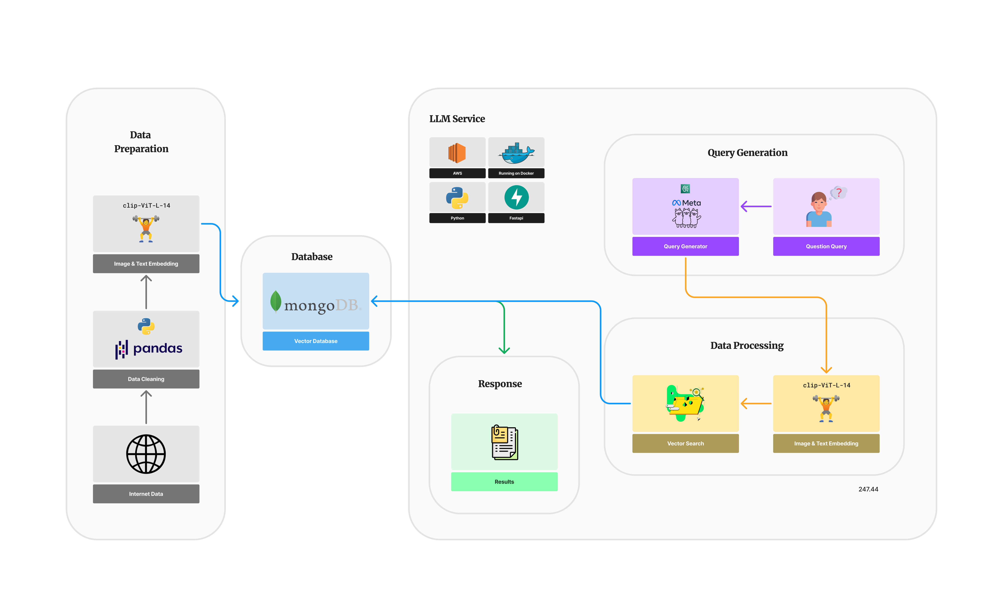

# LocalizeAI

LocalizeAI is an AI-powered location discovery platform designed to help users find the best local spots, from coffee shops to restaurants, in Jakarta and beyond. With both image and text search capabilities, LocalizeAI enables users to explore places, read and share reviews, and navigate local hotspots with ease. The app utilizes a hybrid search system, powered by vector embeddings for text and images and optimized by large language models (LLMs).

## Features

- **Text and Image Search**: Users can search for places by entering text or uploading images for visual discovery.
- **Dynamic Keyword Search**: With the help of LLMs, LocalizeAI dynamically refines search results for relevant, context-aware recommendations.
- **Exploration and Reviews**: Users can explore, review, and discover new spots around the city.

## Tech Stack



- **Backend**: [FastAPI](https://fastapi.tiangolo.com/) - For building a fast, efficient RESTful API.
- **Database**: [MongoDB](https://www.mongodb.com/) - Used to store and manage vectorized data for both images and text search.
- **Embedding Model**: [CLIP-ViT-L-14](https://huggingface.co/openai/clip-vit-large-patch14) - Used for generating embeddings from text and images, making search more accurate and relevant.
- **Tokenizer**: [openai/clip-vit-large-patch14](https://huggingface.co/openai/clip-vit-large-patch14) - Tokenizes input text for compatibility with CLIP-ViT-L-14.
- **LLM Models**:
  - **Primary**: Amazon Bedrock (Llama) - Used for dynamic keyword and context understanding.
  - **Secondary**: GroqCloud (Llama) - Used as a fallback if Bedrock is unavailable.
- **Other Libraries**:
  - **LangChain** - For efficient LLM application management and language chaining.
  - **LangSmith** - Enhances observability for debugging and model performance monitoring.
  - **PyMongo** - Provides a native Python driver for MongoDB interactions.

## Setup and Installation

### Prerequisites

- Python 3.9+
- MongoDB instance (local or hosted)
- AWS Bedrock and/or GroqCloud account credentials
- OpenAI API key for CLIP models

### Installation

1. **Clone the repository**:
   ```bash
   git clone https://github.com/yourusername/LocalizeAI.git
   cd LocalizeAI
   ```

2. **Install dependencies with Poetry**:
   ```bash
   poetry install
   ```

3. **Activate the virtual environment**:
   ```bash
   poetry shell
   ```

4. **Set up environment variables**:

   Copy the example file and rename it, then fill in the required values
   ```bash
   cp .env.example .env
   ```

5. **Run the server**:
   ```bash
   fastapi run app/main.py --host 0.0.0.0 --port 8080
   ```

## Dockerizing the Application

To run LocalizeAI in a Docker container, use the provided `Dockerfile`. Follow the steps below to build and run the container.

1. **Build the Docker Image**:

   Make sure you are in the root directory of the project (where the `Dockerfile` is located), and run:
   ```bash
   docker build -t localizeai .
   ```

2. **Run the Docker Container**:

   Use the following command to run the container, making sure to pass in the environment file (`.env`) for configuration:
   ```bash
   docker run --env-file .env -p 8080:8080 localizeai
   ```

3. **Access the Application**:

   Once the container is running, access the application by navigating to `http://localhost:8080` in your browser or using tools like `curl` or Postman for API testing.

This setup will run the LocalizeAI application within a container, with all dependencies and configurations handled by Docker.

## Usage

### 1. **Indexing Places**

To enable efficient vector-based search, set up a **MongoDB Atlas Search** index with the following configuration:

a. **Navigate to your MongoDB Atlas cluster**.
b. **Go to the "Search" tab** and create a new search index for your collection.
c. **Use the following JSON configuration** to set up the index:

   ```json
   {
     "mappings": {
       "dynamic": true,
       "fields": {
         "embedding": {
           "dimensions": 768,
           "similarity": "cosine",
           "type": "knnVector"
         },
         "type": {
           "type": "token"
         }
       }
     }
   }
   ```

This configuration sets up a **knnVector** field with 768 dimensions using cosine similarity for the `embedding` field, which will store vector embeddings for places. The `type` field is tokenized for efficient text search and filtering. 

###  2. **Search**:
   - **Text Search**: Submit a keyword or phrase to the `/v1/places` endpoint to find relevant places.
   - **Image Search**: Upload an image to the same endpoint to retrieve similar places based on visual embedding.
3. **Explore and Review**: Users can read place details, check reviews, and add new reviews to help other users discover new spots.

## Model Integration

LocalizeAI employs an efficient embedding-based search for location discovery using these models:

- **Amazon Bedrock (Llama)**: The primary model for handling complex queries and improving search relevance.
- **GroqCloud (Llama)**: Secondary fallback for continuity when Bedrock is unavailable.
- **CLIP-ViT-L-14**: Used for converting images and text to vector embeddings for enhanced search matching.

## Watchers

The `watchers` module is responsible for monitoring changes in the database and triggering appropriate actions based on those changes.

### `event_watch.py`

This script watches the change stream for the place reviews collection and processes insert operations.

#### Functions

- `watch_events()`: Watches the change stream for the place reviews collection and processes insert operations by calling the `insert_vector` function.

#### Usage

To run the `event_watch.py` script, execute the following command:

```sh
python app/watchers/event_watch.py
```

## Contributing

1. Fork the repository.
2. Create a new branch.
3. Make your changes.
4. Submit a pull request.

## License

This project is licensed under the MIT License.
